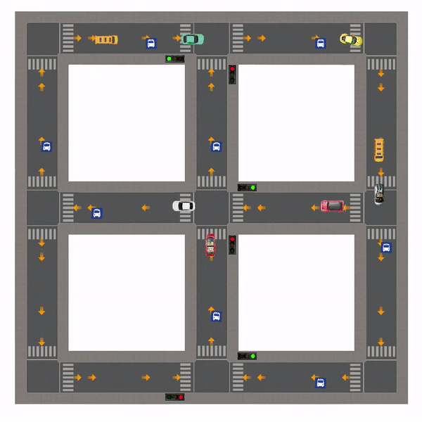

# TrafficSimulator

Traffic Simulator is my Object Oriented Programming course project. Written in C++ using SFML library. Development process is explained in [documents](docs)

  

 
## Requirements
- SFML 2.5.1

## License
[MIT](https://choosealicense.com/licenses/mit/)
